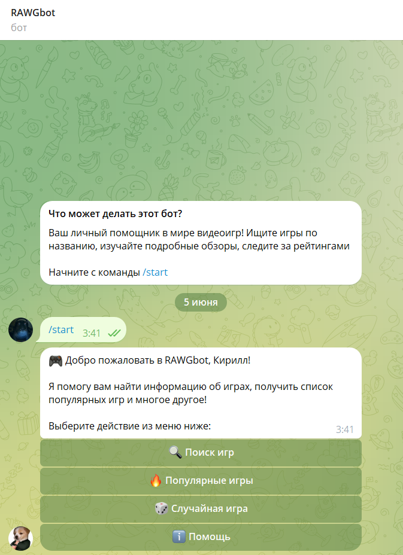
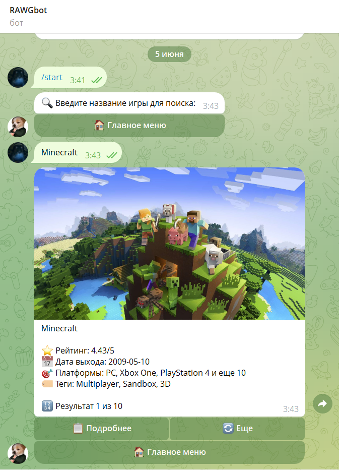
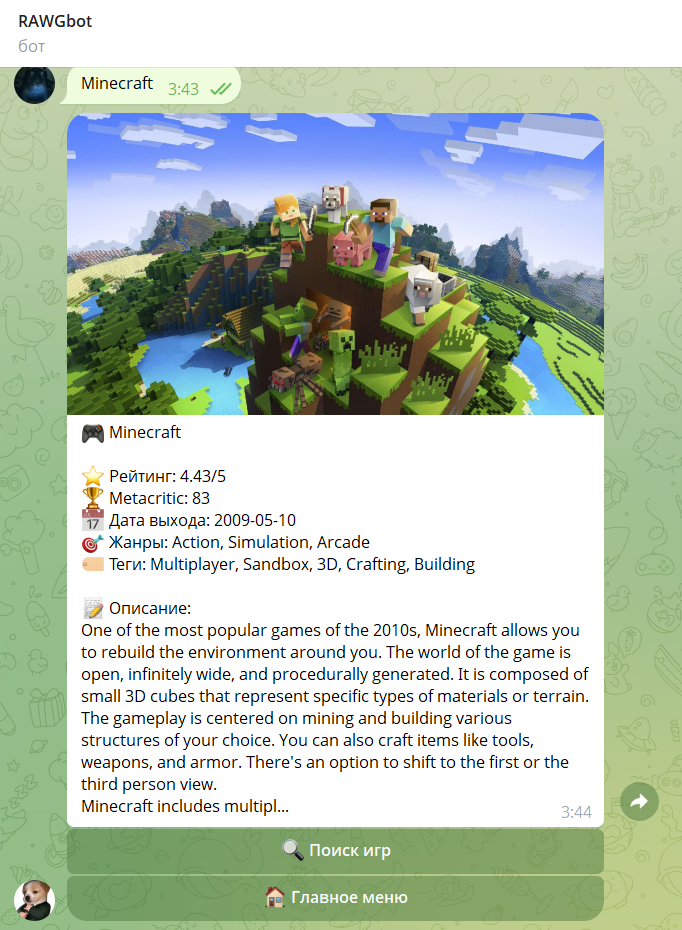

# 🎮 RAWG Games Telegram Bot


## 📸 Скриншоты
<table>
  <tr>
    <td align="center">
      <br>
      <em>Главное меню с основными функциями</em>
    </td>
    <td align="center">
      <br>
      <em>Поиск игр</em>
    </td>
    <td align="center">
      <br>
      <em>Подробности конкретной игры</em>
    </td>
  </tr>
</table>

Telegram-Бота можно открыть по следующей ссылке: https://t.me/rawgws_bot

## 📝 Команды бота
/start - Запустить бота и показать главное меню<br>
/help - Показать справку по командам<br>
/search [название] - Поиск игры по названию<br>
/popular - Показать популярные игры<br>
/random - Показать случайную игру<br>

## 🛠️ Технологии
- **Backend**: Python
- **Framework**: aiogram
- **API**: RAWG Video Games Database API: https://rawg.io/apidocs
- **Библиотеки**:logging

### Установка
1. Клонируйте репозиторий:
```
git clone https://github.com/WonderSi/bot-telegram-semestr4-rawgbot.git
cd bot-telegram-semestr4-rawgbot
```
2. Создайте виртуальное окружение:
```
python -m venv venv
venv\Scripts\activate #Windows
```
3. Установите зависимости:
```
pip install -r requirements.txt
```
4. Создайте файл .env и добавьте ваши ключи:
```
BOT_TOKEN=your_telegram_bot_token_here
RAWG_API_KEY=your_rawg_api_key_here
```
5. Запустите бота:
```
python main.py
```
